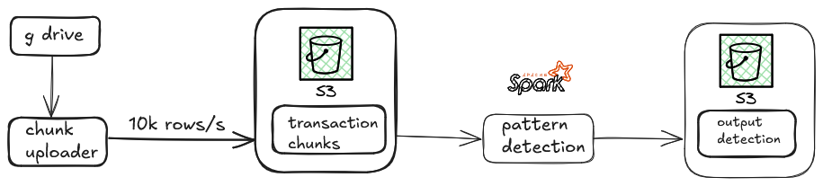

# Customer Pattern Detection

This project simulates a real-time streaming data pipeline using **PySpark** and **AWS S3** to detect customer behavior patterns in merchant transactions.

---

## Architecture



### ⚙️ Mechanism X: Stream Uploader (`chunk_uploader.py`)

- Reads the full transactions file locally.
- Every **1 second**, slices the next **10,000 rows**, saves to `data/raw/`, and uploads to:
  ```
  s3://<S3_BUCKET>/transaction_chunks/chunk_0.csv, chunk_1.csv, ...
  ```

### ⚙️ Mechanism Y: Stream Detector (`stream_detection.py`)

- Monitors the same S3 prefix for new chunks.
- For each chunk:
  1. Reads the CSV file from S3.
  2. Converts it into a Spark DataFrame.
  3. Runs all 3 pattern detection rules.
  4. Writes detection results to:
     ```
     s3://<S3_BUCKET>/output_detections/detection_0.csv, ...
     ```
  - Detections are batched into chunks of 50 rows per file.

---

## Pattern Detection Rules

### Pattern 1 – `UPGRADE`

- Customers in **top 10% by transaction count** for a merchant.
- Also in the **bottom 10% by average importance weight**.
- Only applies to merchants with **≥ 50,000 transactions**.

### Pattern 2 – `CHILD`

- Customers with:
  - **Avg transaction amount < ₹23**
  - **At least 80 transactions** with the merchant.

### Pattern 3 – `DEI-NEEDED`

- Merchant has:
  - **More male customers than female**, but
  - **At least 100 female customers**
- Only includes customers with a **clear gender identity** (1 consistent gender per merchant).

---

## Detection Output Format

Each row in the detection output contains:

| Column        | Description                          |
| ------------- | ------------------------------------ |
| YStartTime    | Start time of chunk processing (IST) |
| detectionTime | Detection timestamp (IST)            |
| patternId     | `PatId1`, `PatId2`, or `PatId3`      |
| actionType    | `UPGRADE`, `CHILD`, or `DEI-NEEDED`  |
| customerName  | Customer ID (empty for DEI-NEEDED)   |
| merchantId    | Merchant ID                          |

---

## S3 Output Paths

| Type        | S3 Location                                         |
| ----------- | --------------------------------------------------- |
| Chunk Input | `s3://<bucket>/transaction_chunks/chunk_<i>.csv`    |
| Detections  | `s3://<bucket>/output_detections/detection_<i>.csv` |

---

## ⚙️ Setup Instructions

1. **Install dependencies**:

   ```bash
   pip install -r requirements.txt
   ```

2. **Configure AWS credentials** in `.env`:
   ```
   AWS_ACCESS_KEY_ID=your_access_key
   AWS_SECRET_ACCESS_KEY=your_secret_key
   ```

---

## 📁 Project Structure

```
├── data/
│ └── raw/                         # data from the gdrive
├── notebooks/
│ └── exploration.ipynb            # Jupyter notebooks for data exploration
├── start_pipeline.py              # Main entry: starts streaming upload and detection
├── config.py                      # Configuration: file paths, S3 info, chunk size
│
├── src/
│   ├── pattern_runner.py          # Orchestrates all 3 pattern detections
│   └── patterns/
│       ├── pat1_upgrade.py        # Pattern 1: UPGRADE
│       ├── pat2_child.py          # Pattern 2: CHILD
│       └── pat3_dei_needed.py     # Pattern 3: DEI-NEEDED
│
└── utils/
    ├── gdrive.py                  # Downloads and loads CSVs from Google Drive
    ├── chunk_uploader.py          # Mechanism X: Uploads 10K chunks/sec to S3
    └── stream_detection.py        # Mechanism Y: Consumes stream, runs detection


```

---
